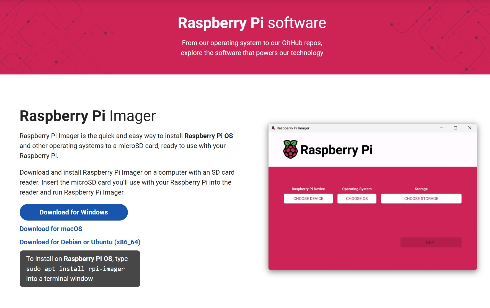
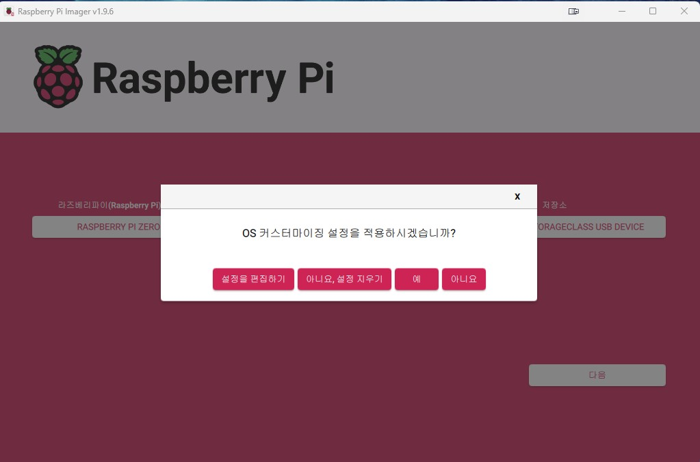
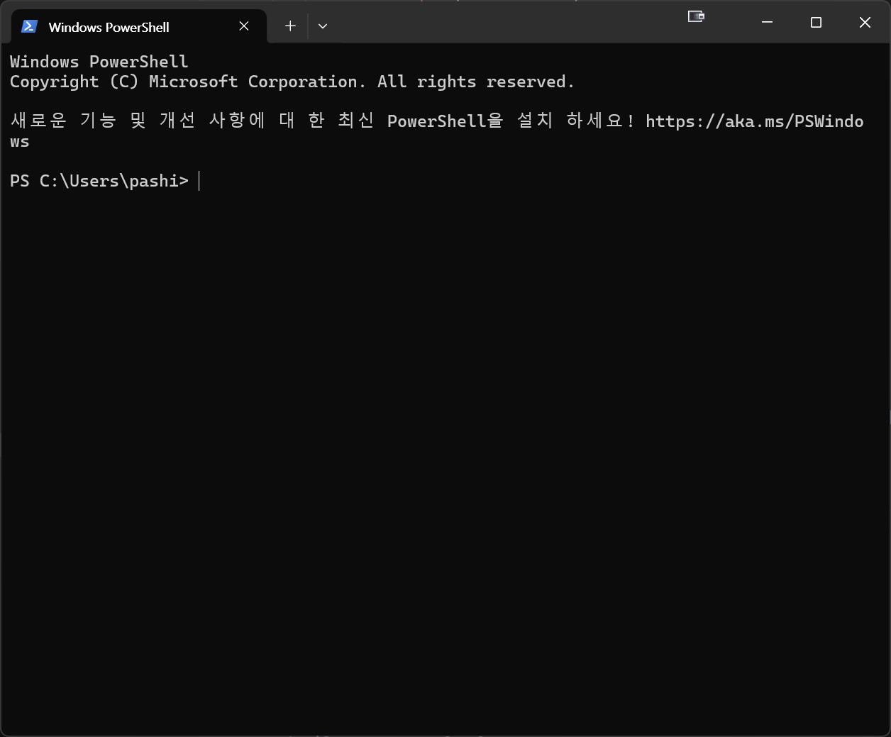
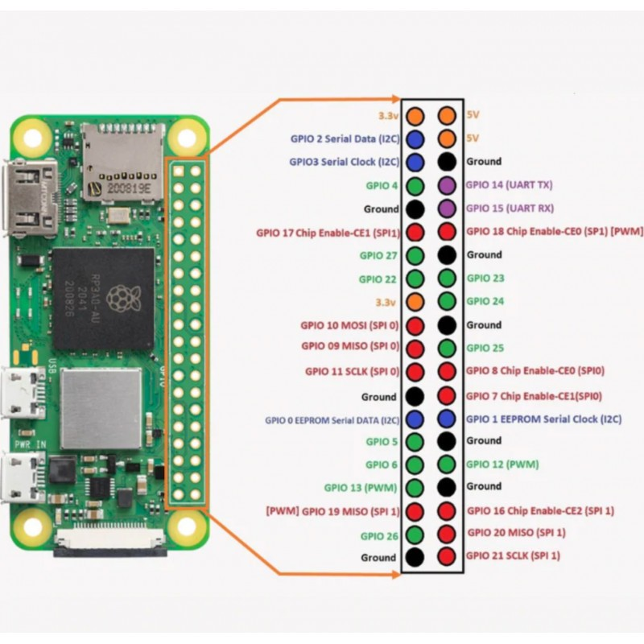

# Raspberry Pi Zero 2 W 세팅 가이드

이 문서는 Poetry Camera (시 카메라) 프로젝트를 위한 Raspberry Pi Zero 2 W의 초기 설정 및 구성 과정을 안내합니다.

이 가이드는 **헤드리스(headless) 설정**을 기준으로 작성되었습니다. 별도의 모니터, 키보드, 마우스 연결 없이 SSH를 통해 Raspberry Pi를 원격으로 설정하고 제어합니다.

## 목차
1. [하드웨어 준비](#1-하드웨어-준비)
2. [Raspberry Pi 초기 설정](#2-raspberry-pi-초기-설정)
3. [카메라 모듈 설정](#3-카메라-모듈-설정)
4. [프린터 설정](#4-프린터-설정)
5. [소프트웨어 설치](#5-소프트웨어-설치)
6. [환경 변수 설정](#6-환경-변수-설정)
7. [자동 실행 설정](#7-자동-실행-설정)
8. [Wi-Fi 네트워크 관리](#8-wi-fi-네트워크-관리)

---

## 1. 하드웨어 준비

### 필요한 구성품
- **Raspberry Pi Zero 2 W** (헤더 포함)
- **MicroSD 카드** (32GB 이상)
- **MicroSD 카드 리더기** (PC/Mac에 연결용)
- **5V MicroUSB 전원 어댑터**
- **방열판** (과열 방지용, 매우 중요!)

### 주의사항
⚠️ **Raspberry Pi Zero 2 W 취급 시 주의사항:**
- 전원 공급에 매우 민감합니다. 전압이 너무 높으면 부품이 손상되고, 너무 낮으면 제대로 작동하지 않습니다.
- 전원을 빼기 전에 반드시 소프트웨어를 수동으로 종료해야 파일 시스템 손상을 방지할 수 있습니다.
- 카메라 커넥터(칼라)가 매우 약하므로 조심스럽게 다루세요.
- 방열판을 반드시 부착하여 과열을 방지하세요.

---

## 2. Raspberry Pi OS 설치

### 2.1 Raspberry Pi Imager 다운로드
1. PC/Mac에서 [Raspberry Pi Imager](https://www.raspberrypi.com/software/)를 다운로드하고 설치합니다.



2. MicroSD 카드를 카드 리더기에 삽입하고 PC/Mac에 연결합니다.

### 2.2 OS 이미지 작성


1. **Raspberry Pi Imager**를 실행합니다.
2. **"CHOOSE DEVICE"** 클릭 → **Raspberry Pi Zero 2 W** 선택
3. **"CHOOSE OS"** 클릭 → **Raspberry Pi OS (64-bit)** 선택 (권장: Raspberry Pi OS Lite가 아닌 전체 버전)
4. **"CHOOSE STORAGE"** 클릭 → 연결된 MicroSD 카드 선택

### 2.3 고급 설정 (매우 중요!)


1. **"NEXT"** 클릭 후 **"EDIT SETTINGS"** 선택
2. **General 탭**에서 다음을 설정:
   - **Set hostname**: `poetry-camera` (또는 원하는 이름)
   - **Set username and password**: 
     - Username: `pi` (또는 원하는 이름)
     - Password: 안전한 비밀번호 설정
   - **Configure wireless LAN**: 
     - SSID: Wi-Fi 네트워크 이름
     - Password: Wi-Fi 비밀번호
     - Wireless LAN country: `KR` (한국)
   - **Set locale settings**:
     - Time zone: `Asia/Seoul`
     - Keyboard layout: `us` (또는 `kr`)

3. **Services 탭**에서:
   - **Enable SSH** 체크
   - **Use password authentication** 선택

4. **"SAVE"** 클릭

### 2.4 이미지 쓰기
1. **"YES"** 클릭하여 이미지 쓰기 시작
2. 쓰기 완료 후 MicroSD 카드를 안전하게 제거합니다.
3. MicroSD 카드를 Raspberry Pi Zero 2 W에 삽입합니다.
4. 전원 어댑터를 연결하여 Pi를 부팅합니다.
5. **Pi가 부팅되고 OS 이미지가 설치될 때까지 1-2분간 대기합니다.** (녹색 LED가 깜빡이면 정상 작동 중)

### 2.5 Windows에서 터미널 실행하기
SSH로 Raspberry Pi에 접속하려면 먼저 Windows 터미널을 실행해야 합니다.



1. `Win` 키를 누르거나 시작 메뉴 클릭
2. "PowerShell" 또는 "터미널" 입력
3. **Windows PowerShell** 또는 **Terminal** 선택


### 2.6 SSH로 Raspberry Pi 접속
터미널이 실행되면 다음 명령어로 Raspberry Pi에 접속합니다:

```powershell
# hostname으로 접속 (권장)
ssh pi@poetry-camera.local
```

> **명령어 설명**: `ssh [username]@[hostname].local` 형식입니다.
> - `pi`: 2.3 단계에서 설정한 **사용자 이름 (username)**
> - `poetry-camera`: 2.3 단계에서 설정한 **호스트 이름 (hostname)**
> - 다른 이름으로 설정했다면 해당 이름으로 변경하세요.

만약 `.local` 주소로 접속이 안 되면, 라우터 관리 페이지에서 Pi의 IP 주소를 확인한 후:
```powershell
# IP 주소로 접속 (예시)
ssh pi@192.168.0.100
```

> **참고**: 
> - 위 명령어의 `pi`는 2.3 단계에서 Raspberry Pi Imager의 고급 설정에서 설정했던 사용자 이름입니다. 
> - `poetry-camera`는 2.3 단계에서 설정한 hostname입니다.
> - 다른 이름으로 설정했다면 해당 이름으로 변경하세요.

**첫 접속 시 나타나는 메시지:**
```
The authenticity of host 'poetry-camera.local (192.168.x.x)' can't be established.
...
Are you sure you want to continue connecting (yes/no/[fingerprint])?
```
→ `yes` 입력 후 Enter

**비밀번호 입력:**
- 2.3 단계에서 설정한 비밀번호를 입력합니다.
- 입력 중에는 화면에 아무것도 표시되지 않지만 정상입니다.
- 입력 완료 후 Enter

접속에 성공하면 다음과 같은 화면이 나타납니다:
```
pi@poetry-camera:~ $
```

### 2.7 시스템 업데이트
SSH 접속 후 다음 명령을 실행합니다:

```bash
sudo apt-get update
sudo apt-get upgrade -y
```

> **참고**: 최초 설치 시에는 업데이트할 패키지가 많아 시간이 다소 걸릴 수 있습니다 (5-15분). 
> 인터넷 속도에 따라 더 오래 걸릴 수도 있으니 여유를 가지고 기다려주세요.

### 2.8 Raspberry Pi 구성 설정
Raspberry Pi 하드웨어 설정을 변경합니다:

```bash
sudo raspi-config
```

다음 설정을 변경하세요:
- **카메라 설정**: 최신 Raspberry Pi OS에서는 카메라 옵션이 기본적으로 없으며, libcamera가 자동으로 활성화되어 있습니다.
- **Interface Options → Serial Port** 선택:
  - "Would you like a login shell to be accessible over serial?" → **No** 선택
  - "Would you like the serial port hardware to be enabled?" → **Yes** 선택
  - Finish로 빠져나옵니다.

설정 변경 후 재부팅이 필요합니다. raspi-config 종료 시 자동으로 재부팅 여부를 물어보므로, **Yes**를 선택하면 별도로 재부팅 명령을 실행할 필요가 없습니다.
```bash
sudo reboot  # 자동 재부팅을 선택하지 않은 경우에만 실행
```

---

## 3. 카메라 모듈 설정

### 3.1 카메라 하드웨어 연결
1. **Raspberry Pi의 전원을 끕니다** (매우 중요!)
2. **카메라 커넥터 열기**: 
   - Pi Zero 2 W의 카메라 포트(CSI 포트) 옆 검은색 플라스틱 칼라를 부드럽게 위로 당깁니다.
   - 핀셋을 사용하면 더 안전합니다.
3. **카메라 케이블 삽입**:
   - Pi Zero 2용 짧은 카메라 케이블(또는 별도 구매한 긴 케이블)을 준비합니다.
   - 파란색 면이 HDMI 포트 쪽을 향하도록 케이블을 삽입합니다.
   - 칼라를 다시 아래로 눌러 고정합니다.
4. **카메라 모듈 연결**: 케이블의 반대편을 카메라 모듈에 연결합니다.

⚠️ **정전기 주의**: 카메라 모듈은 정전기에 매우 민감합니다. 사용하지 않을 때는 반드시 정전기 차폐 봉투에 보관하세요.

### 3.2 필요한 패키지 설치
카메라와 프린터를 사용하기 위한 패키지들을 설치합니다:

```bash
sudo apt-get install git cups build-essential libcups2-dev libcupsimage2-dev python3-serial python3-pil python3-unidecode rpicam-apps -y
```

### 3.3 카메라 테스트
```bash
# 카메라가 인식되는지 확인 (최신 명령어)
rpicam-hello -n

# 또는 구버전 명령어 (일부 시스템에서 여전히 작동)
# libcamera-hello

# 테스트 사진 촬영
rpicam-jpeg -o test.jpg

# 또는 구버전 명령어
# libcamera-jpeg -o test.jpg
```

정상적으로 작동하면 `test.jpg` 파일이 생성됩니다.

---

## 4. 프린터 설정

### 4.1 Adafruit Thermal Printer 드라이버 설치
```bash
cd ~
git clone https://github.com/adafruit/zj-58
cd zj-58
make
sudo ./install
```

> **참고**: `make` 명령 실행 시 여러 개의 경고 메시지(`deprecated` 관련)가 나타날 수 있습니다. 이는 오래된 CUPS API를 사용하기 때문이며, 컴파일은 정상적으로 완료되고 프린터 기능에는 전혀 영향을 주지 않습니다. 경고 메시지가 나타나더라도 문제없이 다음 단계(`sudo ./install`)를 진행하면 됩니다.

### 4.2 프린터 하드웨어 연결
열전사 프린터를 Raspberry Pi에 연결합니다:



| 프린터 핀 | Pi GPIO 핀 | 물리적 핀 번호 |
|---------|-----------|-------------|
| GND     | GND       | 6, 9, 14, 20, 25, 30, 34, 39 중 아무거나 |
| RX      | TX (GPIO 14) | 핀 8 |
| TX      | RX (GPIO 15) | 핀 10 |

**추가 GPIO 연결:**
- **셔터 버튼**: GPIO20 (핀 38)
- **LED**: GPIO16 (핀 36)

⚠️ **중요**: TX와 RX는 **교차 연결**해야 합니다!
- 프린터의 **RX** → Pi의 **TX** (GPIO 14)
- 프린터의 **TX** → Pi의 **RX** (GPIO 15)

**버튼 및 LED 연결 상세:**
- **셔터 버튼**: 한쪽을 GPIO20에, 다른 쪽을 GND에 연결 (내부 풀업 저항 사용)
- **LED**: 양극(+)을 GPIO16에, 음극(-)을 GND에 연결 (필요시 330Ω 저항 추가)

**전원 연결**:
- 프린터의 DC 전원 커넥터에 5V 전원 어댑터를 연결합니다.
- 프린터와 Pi는 **별도의 전원**을 사용해야 합니다.

### 4.3 프린터 보드레이트 확인
프린터의 보드레이트를 확인하세요 (일반적으로 `19200` 또는 `9600`).
이 값은 나중에 코드에서 사용됩니다.

---

## 5. 소프트웨어 설치

### 5.1 Poetry Camera 저장소 클론
```bash
cd ~
git clone https://github.com/pashiran/poetry-camera-rpi.git
cd poetry-camera-rpi
```

> **참고**: 이 저장소는 한국어 문서와 최신 OpenAI Vision API를 사용하도록 개선된 버전입니다.

### 5.2 Python 패키지 설치

Poetry Camera에 필요한 패키지를 설치합니다:

```bash
pip3 install -r requirements-minimal.txt --break-system-packages
```

> **참고**: 
> - 최신 Raspberry Pi OS에서는 `externally-managed-environment` 오류를 방지하기 위해 `--break-system-packages` 옵션이 필요합니다.
> - `requirements-minimal.txt`에는 프로젝트 실행에 필요한 핵심 패키지만 포함되어 있어 안정적으로 설치됩니다.

**설치되는 주요 패키지:**
- `picamera2`: 카메라 제어
- `google-generativeai`: Google Gemini API 클라이언트 (이미지→시 변환)
- `python-dotenv`: 환경 변수 관리 (.env 파일 읽기)
- `Pillow`: 이미지 처리 (Gemini API에 이미지 전달용)
- `gpiozero`: GPIO 핀 제어 (버튼/LED)
- `requests`: HTTP 요청 (Gemini API 내부에서 사용)
- `python-escpos`: 향상된 열전사 프린터 지원 (한글 이미지 출력용)

> **Adafruit_Thermal.py와 wraptext.py**: 프린터 제어를 위한 라이브러리들이 저장소에 포함되어 있어 별도 설치가 불필요합니다.
- `requests`: HTTP 요청 (Gemini API 내부에서 사용)
- `python-escpos`: 향상된 열전사 프린터 지원 (한글 이미지 출력용)

> **Adafruit_Thermal.py와 wraptext.py**: 프린터 제어를 위한 라이브러리들이 저장소에 포함되어 있어 별도 설치가 불필요합니다.

**설치 확인:**
```bash
pip3 list | grep -E "(google|picamera2|dotenv|Pillow|gpiozero|escpos|requests)"
```

다음과 같이 표시되어야 합니다:
```
google-ai-generativelanguage  x.x.x
google-generativeai           x.x.x
picamera2                     x.x.x
Pillow                        x.x.x
python-dotenv                 x.x.x
python-escpos                 x.x.x
gpiozero                      x.x.x
requests                      x.x.x
```

### 5.3 프린터 보드레이트 확인
이 저장소의 `main.py`는 보드레이트가 `19200`으로 설정되어 있습니다. 대부분의 열전사 프린터에서 작동하지만, 만약 프린터가 다른 보드레이트를 사용한다면 `main.py` 파일을 수정하세요:

```bash
nano ~/poetry-camera-rpi/main.py
```

보드레이트 값을 변경:
```python
baud_rate = 19200  # 프린터에 맞게 수정 (일반적으로 9600 또는 19200)
```

---

## 6. 환경 변수 설정

### 6.1 Google Gemini API 키 발급

이 프로젝트는 원래 OpenAI의 GPT-4 Vision API를 사용했으나, **결제 및 비용 문제**로 인해 Google Gemini API로 전환했습니다.

**OpenAI API의 문제점:**
- ❌ **신용카드 등록 필수**: API 사용을 위해 무조건 결제 수단을 등록해야 함
- ❌ **자동 결제 위험**: 무료 크레딧($5-18) 소진 후 자동으로 유료 전환되어 예상치 못한 요금 청구
- ❌ **2회 API 호출 필요**: 이미지 분석 + 시 생성 = 비용 2배

**Gemini API를 선택한 이유:**
- ✅ **신용카드 불필요**: API 키만으로 바로 사용 가능
- ✅ **완전 무료**: 일일 1,500회 요청까지 무료 (일반 사용에 충분)
- ✅ **자동 결제 없음**: 한도 초과 시 API 호출만 실패, 요금 청구 안 됨
- ✅ **더 효율적**: 이미지 분석 + 시 생성을 1번의 API 호출로 처리
- ✅ **빠른 속도**: Gemini 2.5 Flash 모델은 매우 빠름
- ✅ **멀티모달**: 이미지와 텍스트를 동시에 이해

**API 키 발급 방법:**

1. [Google AI Studio](https://makersuite.google.com/app/apikey)에 접속합니다.
2. Google 계정으로 로그인합니다. (**결제 정보 등록 불필요**)
3. **"Create API Key"** 버튼을 클릭합니다.
4. **"Create API key in new project"** 를 선택합니다.
5. 생성된 API 키를 복사합니다 (나중에 다시 볼 수 없으니 안전한 곳에 저장하세요).

**무료 사용 한도:**
- 분당 15회 요청 (RPM)
- 일일 1,500회 요청 (RPD)
- 월 1백만 토큰
- **중요**: 한도 초과 시 자동 결제 없음, API 호출만 실패

사진 한 장당 API 호출 1회만 필요하므로, 하루에 50장 정도 촬영해도 여유가 있습니다!

### 6.2 사용 가능한 Gemini 모델

이 프로젝트는 `models/gemini-2.5-flash` 모델을 사용합니다. 다른 모델로 변경할 수도 있습니다:

| 모델명 | 속도 | 품질 | 권장 용도 |
|--------|------|------|-----------|
| `models/gemini-2.5-pro` | 느림 | 최고 | 시 품질 최우선 |
| `models/gemini-2.5-flash` | 빠름 | 좋음 | **기본 권장** ⭐ |
| `models/gemini-2.5-flash-lite` | 매우 빠름 | 기본 | 빠른 테스트 |
| `models/gemini-2.0-flash` | 빠름 | 좋음 | 이전 세대 |

모델을 변경하려면 `main.py` 파일에서 다음 줄을 수정하세요:
```python
model = genai.GenerativeModel('models/gemini-2.5-flash')  # 원하는 모델명으로 변경
```

사용 가능한 모든 모델 목록 확인:
```bash
python3 -c "
import os
from dotenv import load_dotenv
import google.generativeai as genai

load_dotenv()
genai.configure(api_key=os.environ.get('GOOGLE_API_KEY'))

for model in genai.list_models():
    if 'generateContent' in model.supported_generation_methods:
        print(model.name)
"
```

### 6.3 .env 파일 생성
```bash
cd ~/poetry-camera-rpi
nano .env
```

다음 내용을 추가합니다:
```
GOOGLE_API_KEY=your_actual_api_key_here
```

**중요:** `your_actual_api_key_here`를 6.1 단계에서 발급받은 실제 API 키로 교체하세요!

저장하고 종료: `Ctrl+X`, `Y`, `Enter`

### 6.4 API 키 테스트

설정이 올바른지 확인:
```bash
python3 -c "
import os
from dotenv import load_dotenv
import google.generativeai as genai

load_dotenv()
api_key = os.environ.get('GOOGLE_API_KEY')

if not api_key:
    print('❌ API 키를 찾을 수 없습니다. .env 파일을 확인하세요.')
else:
    print(f'✓ API 키 발견: {api_key[:10]}...{api_key[-4:]}')
    try:
        genai.configure(api_key=api_key)
        model = genai.GenerativeModel('models/gemini-2.5-flash')
        response = model.generate_content('Say hello in one word')
        print('✓ API가 정상적으로 작동합니다!')
        print(f'응답: {response.text}')
    except Exception as e:
        print(f'❌ API 오류: {e}')
"
```

성공 메시지가 나타나면 준비 완료!

---

## 7. 자동 실행 설정

### 7.1 수동 테스트
먼저 스크립트가 정상적으로 작동하는지 확인합니다:

```bash
cd ~/poetry-camera-rpi
python3 main.py
```

셔터 버튼의 LED가 켜지고, 버튼을 누르면 사진을 찍고 시를 출력하는지 확인합니다.

### 7.2 부팅 시 자동 실행 설정
Cron 작업을 설정하여 부팅 시 자동으로 스크립트를 실행하도록 합니다:

```bash
crontab -e
```

편집기가 열리면 다음 줄을 맨 아래에 추가합니다:
```
@reboot python3 /home/pashiran/poetry-camera-rpi/main.py >> /home/pashiran/poetry-camera-rpi/errors.txt 2>&1
```

> **중요**: 위 경로에서 `pashiran`을 2.3 단계에서 설정한 **실제 사용자 이름**으로 변경하세요. 예를 들어 사용자 이름이 `pi`라면 `/home/pi/poetry-camera-rpi/...`로 수정합니다.

**설명**:
- `@reboot`: 부팅 시 실행
- `>> .../errors.txt 2>&1`: 오류 메시지를 파일로 저장 (디버깅용)

저장하고 종료한 후 재부팅하여 테스트합니다:
```bash
sudo reboot
```

### 7.3 자동 실행 확인
재부팅 후:
1. LED가 켜질 때까지 기다립니다 (준비 완료 신호)
2. 셔터 버튼을 눌러 정상 작동하는지 확인합니다
3. 문제가 있다면 `errors.txt` 파일을 확인합니다:
   ```bash
   cat ~/poetry-camera-rpi/errors.txt
   ```

---

## 8. Wi-Fi 네트워크 관리

### 8.1 단일 Wi-Fi 네트워크 설정
기본 Wi-Fi 네트워크를 설정합니다:

```bash
sudo raspi-config
```
- **System Options → Wireless LAN**에서 SSID와 비밀번호를 입력합니다.

### 8.2 여러 Wi-Fi 네트워크 설정
`wpa_supplicant.conf` 파일을 편집하여 여러 네트워크를 추가할 수 있습니다:

```bash
sudo nano /etc/wpa_supplicant/wpa_supplicant.conf
```

다음 형식으로 네트워크를 추가합니다:
```
network={
    ssid="WiFi_이름_1"
    psk="비밀번호_1"
    priority=1
}

network={
    ssid="WiFi_이름_2"
    psk="비밀번호_2"
    priority=2
}
```
`priority` 값이 높을수록 우선순위가 높습니다.

### 8.3 이동 중 Wi-Fi 변경 (고급)
외부에서 쉽게 Wi-Fi를 변경하려면 [Raspberry Pi 공식 호텔 Wi-Fi 튜토리얼](https://www.raspberrypi.com/tutorials/host-a-hotel-wifi-hotspot/)을 참고하세요.

**추가로 필요한 하드웨어**:
- USB Wi-Fi 어댑터 (Raspberry Pi와 호환되는 제품)
- MicroUSB→USB 어댑터

**작동이 확인된 Wi-Fi 어댑터**:
- [LOTEKOO, Amazon](https://www.amazon.com/dp/B06Y2HKT75)
- [Canakit, Amazon](https://www.amazon.com/dp/B00GFAN498)

---

## 트러블슈팅

### 카메라가 인식되지 않음
```bash
# 카메라 감지 확인
vcgencmd get_camera

# 출력이 "supported=1 detected=1"이어야 함
```

### 프린터가 응답하지 않음
1. 프린터 전원이 켜져 있는지 확인
2. 배선이 올바른지 확인 (TX↔RX 교차 연결)
3. 보드레이트가 일치하는지 확인
4. 시리얼 포트 활성화 확인: `sudo raspi-config`

### Google Gemini API 오류

**오류: "API 키를 찾을 수 없습니다"**
```bash
cd ~/poetry-camera-rpi
cat .env  # GOOGLE_API_KEY가 올바르게 설정되었는지 확인
```

**오류: "404 models/... is not found"**
- 모델 이름이 잘못되었습니다. 사용 가능한 모델 확인:
```bash
python3 -c "
import os
from dotenv import load_dotenv
import google.generativeai as genai
load_dotenv()
genai.configure(api_key=os.environ.get('GOOGLE_API_KEY'))
for m in genai.list_models():
    if 'generateContent' in m.supported_generation_methods:
        print(m.name)
"
```
- `main.py`에서 올바른 모델명 사용 (예: `models/gemini-2.5-flash`)

**오류: "Resource exhausted" 또는 "Quota exceeded"**
- 무료 한도 초과. [Google AI Studio](https://makersuite.google.com/app/apikey)에서 사용량 확인
- 잠시 기다렸다가 다시 시도 (분당 15회 제한)

**오류: "API key not valid"**
1. API 키가 올바른지 확인
2. `.env` 파일에 공백이나 따옴표가 없는지 확인:
   ```
   GOOGLE_API_KEY=AIzaSy...  # 올바름
   GOOGLE_API_KEY="AIzaSy..."  # 따옴표 제거
   GOOGLE_API_KEY= AIzaSy...  # 공백 제거
   ```

**패키지 설치 확인:**
```bash
pip3 show google-generativeai
```

**인터넷 연결 확인:**
```bash
ping -c 3 google.com
```

### 부팅 시 자동 실행 안 됨
1. `errors.txt` 파일 확인
2. 경로가 절대 경로인지 확인
3. 사용자명이 `pi`가 아니라면 경로 수정 필요
4. Python 스크립트에 실행 권한 확인:
   ```bash
   chmod +x ~/poetry-camera-rpi/main.py
   ```

### 전원 문제
- Pi가 자주 재부팅됨: 전원 공급이 부족 (최소 5V 1.2A 필요)
- 프린터 인쇄 중 Pi 종료: 프린터와 Pi를 별도 전원으로 사용
- 저전압 경고: 더 강력한 전원 어댑터 사용

---

## 다음 단계

설정이 완료되었다면 [메인 README](README.md)로 돌아가 다음 단계를 진행하세요:
- 버튼과 LED 연결
- 전원 회로 구성
- 케이스 제작 및 최종 조립

---

## 참고 자료
- [Raspberry Pi 공식 문서](https://www.raspberrypi.com/documentation/)
- [Adafruit Thermal Printer 가이드](https://learn.adafruit.com/networked-thermal-printer-using-cups-and-raspberry-pi)
- [libcamera 문서](https://www.raspberrypi.com/documentation/computers/camera_software.html)
